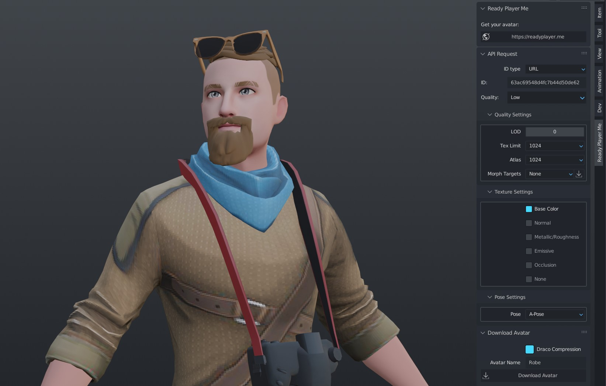

# Ready Player Me - Blender Tools

This is a collection of tools for Blender to help with the management of 3D Avatar by Ready Player Me.

## Installation

1. Download the repo as a zip file
2. Open Blender and go to Edit > Preferences > Add-ons
3. Click Install and select the zip file

## Usage

Paste the avatar id from the Ready Player Me website into the Avatar ID field in the Ready Player Me panel.
Set the options for the avatar and click the Download button.

## TODO

### Ready Player Me Panel

- [x] Add support for downloading the avatar as a single .glb file
- [x] Add `?quality=`
- [x] Add `?meshLod=`
- [x] Add `?textureSizeLimit=`
- [x] Add `?textureAtlas=`
- [x] Add `?morphTargets=`
- [x] Add `?textureChannels=`
- [ ] Add `?pose=`
- [ ] Add `?useDracoMeshCompression=`

### Mixamo Panel

- [ ] Create the panel...
- [ ] ...

...
